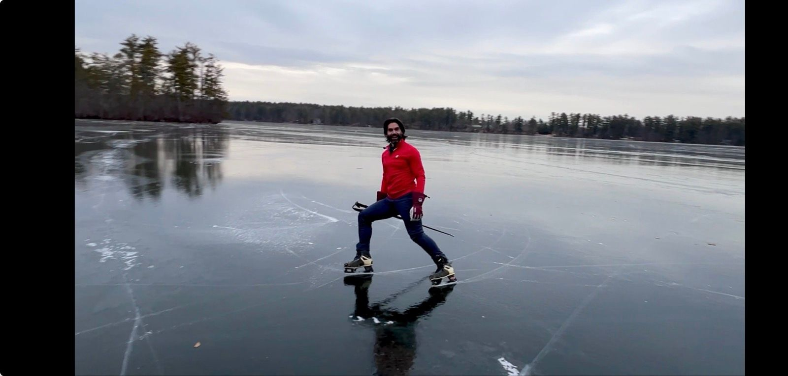
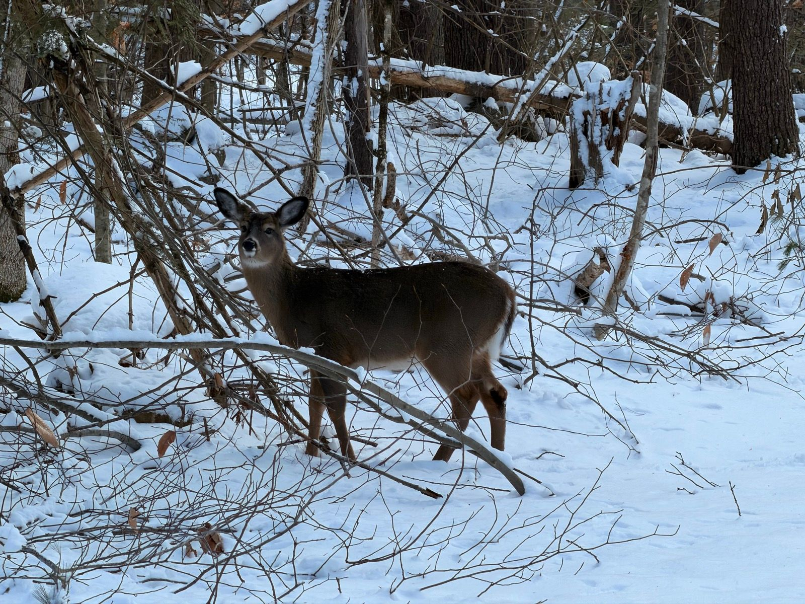
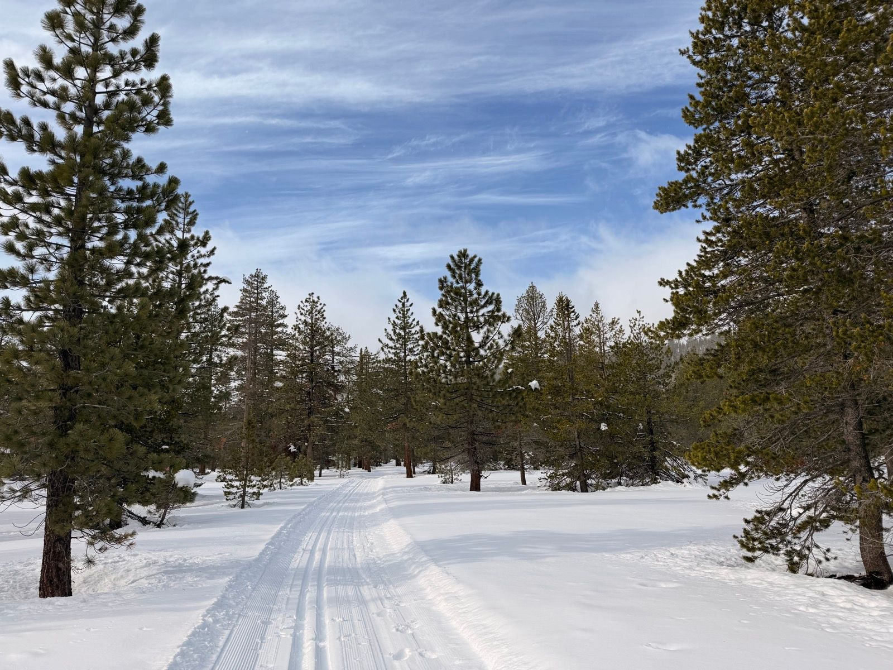
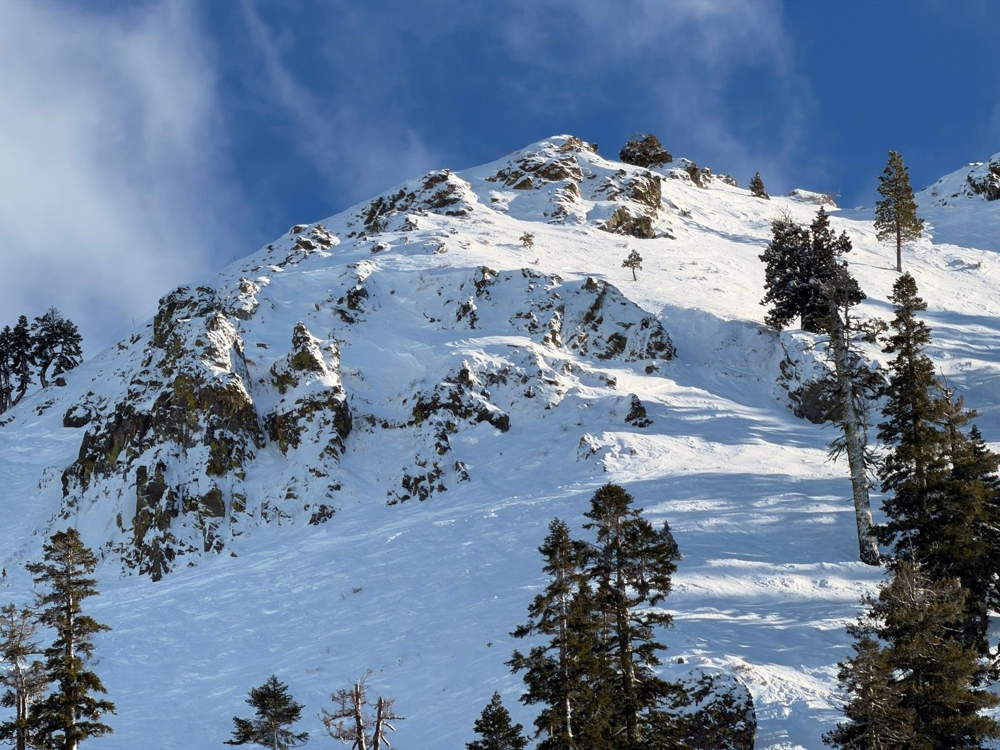
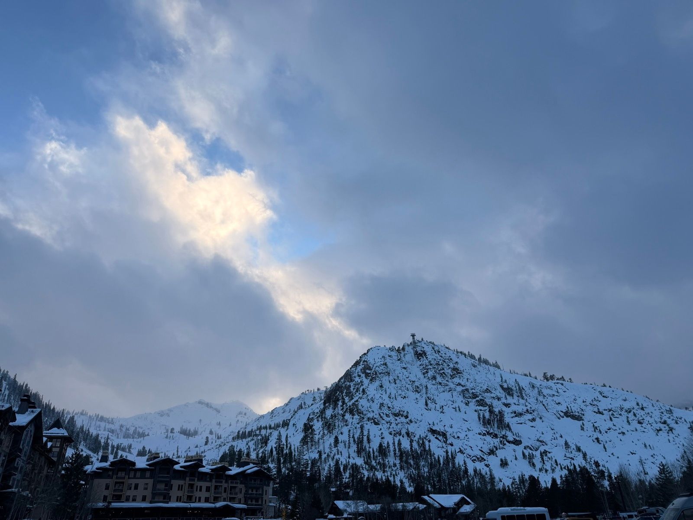
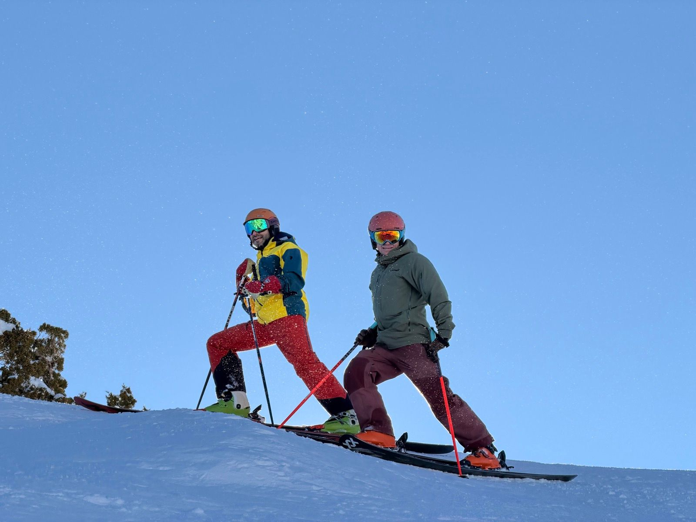

# Chapter 1: The Winter Return

*December 21, 2025 - January 9, 2026*

---

## Prologue: Coming Back to Life

The body remembers what the mind forgets. After a fall that left me nursing injuries through autumn, I wasn't sure what shape I'd find myself in when winter finally arrived. The squash court was the test.

### Afternoon Squash from the Grave
*December 21 | Workout | 1h 49m | HR max: 162*

Couple injuries in the fall means not remotely in squash shape. Some warmup, one game where the feet moved where the brain asked them to, then three games where the feet were in molasses and on strike.

The verdict was in: I was alive, but rusty. The legs had forgotten how to listen. But there's something clarifying about being humbled by a sport you once knew well. It strips away any illusions and leaves you with a simple question: do you want to get back?

---

## Part I: The Slow Rebuild

The next week was about patience. The elliptical doesn't inspire poetry, but it builds the base.

### Afternoon Elliptical
*December 29 | 20m | HR max: 135*

Twenty minutes of mechanical motion. Heart rate climbing, sweat forming, the body remembering what effort feels like. No glory here, just the grunt work of conditioning.

### Lunch Elliptical
*December 31 | 15m | HR max: 194*

New Year's Eve. While others were uncorking champagne, I was watching my heart rate spike on a machine going nowhere. There's a metaphor in there somewhere, but I was too busy gasping to find it.

---

## Part II: The Frozen Lake

And then, a gift.

### Afternoon Ice Skate
*December 23 | 37m | 4.5 km | HR max: 100*

Been 20+ years but apparently I still know how to do this.

The lake was a sheet of black glass, reflecting bare trees and pewter sky. I pushed off tentatively, expecting to wobble like a newborn deer. But the blade found its edge, the weight shifted, and suddenly I was gliding. Twenty years melted away. The body remembered.

Some skills hibernate. They wait patiently in whatever neural basement stores such things, until you give them permission to wake up. That afternoon, skating across natural ice for the first time since childhood, I felt something unlock. Not just muscle memory, but something older. Joy, maybe. Or just the simple pleasure of moving through cold air on a surface that shouldn't hold you but does.

---

## Part III: Around the Old Haunts

### Walk Around the Pond
*December 24 | 1h 58m | 7.4 km*

The day before Christmas. A long walk around familiar terrain, watching the light turn golden on snow-dusted pines. These are the moments that don't fit neatly into training logs. No pace to optimize, no heart rate zone to hit. Just moving through landscape, letting the mind unspool.

### Afternoon Nordic Ski
*December 25 | 1h 34m | 6.0 km | HR max: 90*

Around the old haunts. Remembered a jump I barely had the courage to half do as an 8 year old.

Christmas Day. The trails I learned to ski on decades ago, now seen through adult eyes. The jump that once seemed terrifying is just a gentle roll in the terrain. But the deer stepping through bare branches, the silence of snow absorbing sound, the rhythm of kick and glide - those are unchanged. Some things stay exactly where you left them.

---

## Part IV: Into the Whites

### Scooting Around the Whites
*December 28 | 2h 1m | 9.0 km | Nordic Ski | HR max: 107*

The legs were coming back. Two hours of Nordic skiing through high country, the lungs learning to work at altitude again. Each kick a small rebellion against the months of recovery, each glide a vote of confidence in what the body could still do.

---

## Part V: The Mountain

The slow rebuild was over. Time to see what was left.

### Morning Alpine Ski - First Day
*January 6 | 4h 36m | 58 km | Alpine Ski | HR max: 147*

First day, felt decent considering.

Fifty-eight kilometers of skiing. Nearly 6,000 meters of vertical. The kind of numbers that would have seemed impossible two weeks ago when I couldn't move my feet fast enough for squash. But mountains have a way of pulling effort out of you. Each run down, each chairlift up, the altitude and cold air conspiring to make you feel more alive than any gym ever could.

### Morning Nordic Ski
*January 7 | 1h 16m | 8.2 km | HR max: 131*

The snow was too soft to skate so I did some classic in skate skis, which is a pretty good workout. It turns out, if a little inelegant.

There's an honesty to Nordic skiing that alpine lacks. No lift to carry you, no gravity to do the work. Just you and the snow and whatever engine you've built. Using skate skis for classic technique is like speaking a language with the wrong accent - you can make yourself understood, but it's not pretty. I didn't care. The morning was mine, and I was moving.

### Afternoon Alpine Ski
*January 7 | 1h 46m | 30 km | HR max: 143*

Double-header day. Nordic in the morning, alpine in the afternoon. The legs should have been tired but they weren't. Something about this trip - the cold air, the early nights, the absence of screens and schedules - was working better than any recovery protocol.

### Hikes, Groomers, Powder, Wind, Snacks, Friends
*January 8 | 5h | 58 km | Alpine Ski | HR max: 145*

And a patrol dog.

The best days resist summary. This was one of those. Bootpacking up to terrain that earned its turns. Ripping groomers when the legs needed a break. Finding pockets of powder that no one else had touched. Wind at the summit strong enough to lean into. Snacks eaten standing up, goggles fogged, friends laughing at nothing in particular.

And somewhere in the middle of it all, a ski patrol dog appeared, all wagging tail and snow-crusted fur, as if the mountain itself had sent an ambassador to say: you belong here.

### Cold Chalky Goodness and a Great Friend Catchup
*January 9 | 3h 17m | 43 km | Alpine Ski*

The last day. Cold temperatures had turned the snow chalky - that particular texture that squeaks under your edges and holds a turn like a promise. A long day skiing with an old friend, conversations happening at chairlift speed, silences comfortable enough to share a run in parallel without needing to fill them.

---

## Epilogue: What Returns

Three weeks. From feet in molasses to standing atop ridgelines with friends, watching ski tracks snake through untouched bowls below. The body came back faster than I expected. Maybe it always does, when you give it something worth coming back for.

But something else returned too. Not just fitness or skill, but that particular winter feeling - the one where cold air in your lungs feels like fuel, where every chairlift ride is an intermission, where exhaustion at day's end is indistinguishable from satisfaction.

Twenty years since I'd skated on a frozen lake. Decades since I'd skied those childhood trails. The skills were still there, waiting. And now I wonder what else might be waiting, patient and dormant, for the right winter to wake up.

---

*Chapter 1 Complete*

**Stats Summary:**
- Total activities: 10
- Total distance: 214 km
- Activity types: Squash, Elliptical, Ice Skating, Walking, Nordic Skiing, Alpine Skiing
- Vertical gained: 17,000+ meters
- Deer spotted: 1
- Patrol dogs befriended: 1
- Years since last ice skate: 20+

---

*Next chapter: Earlier adventures await...*
