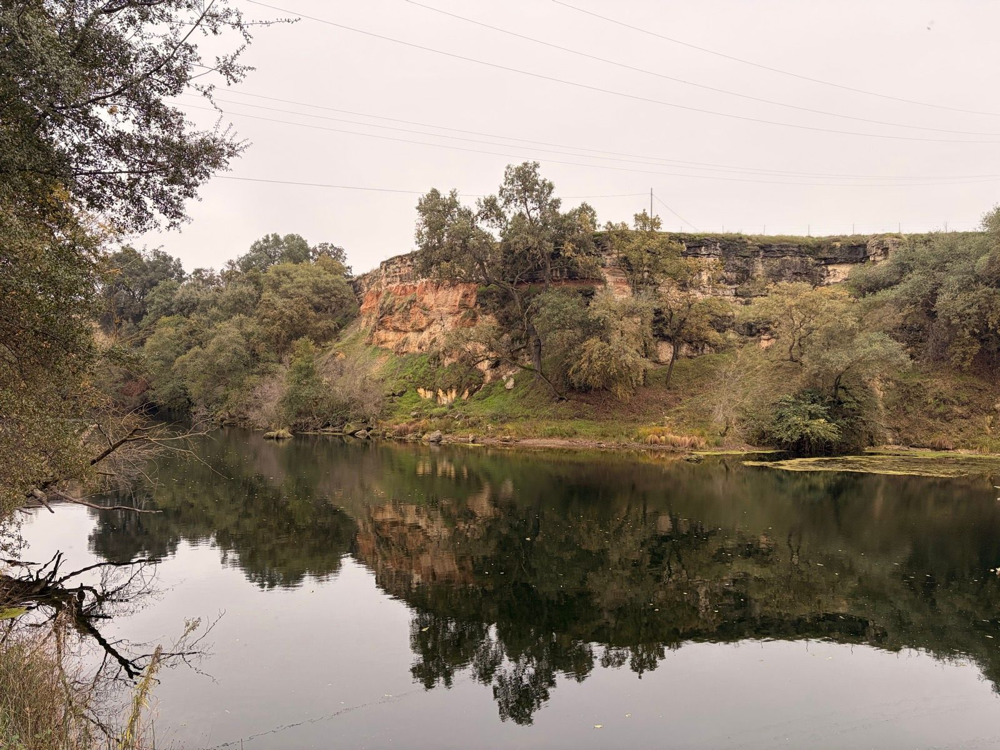
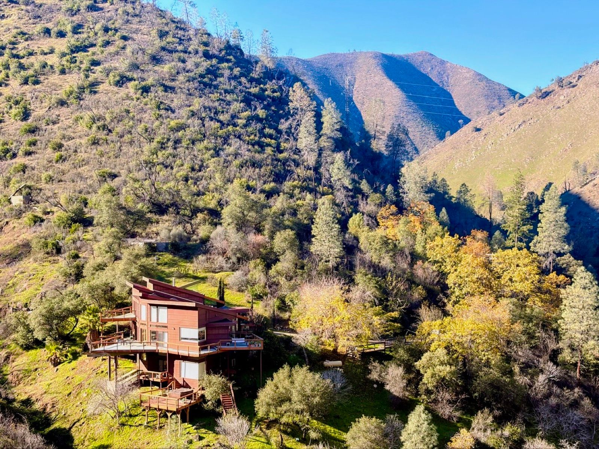
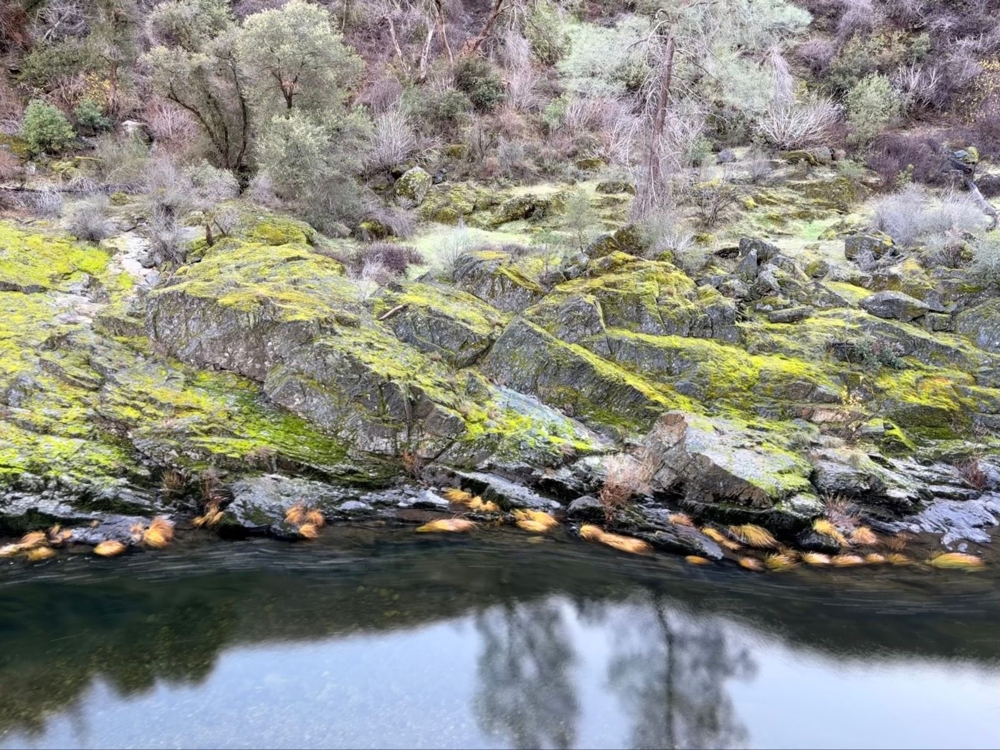
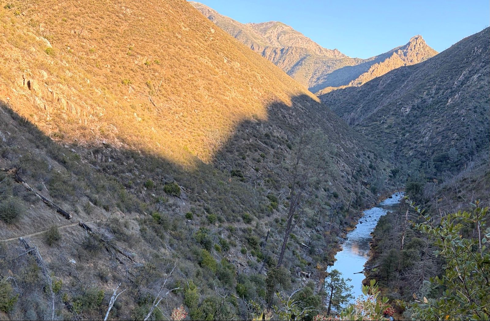
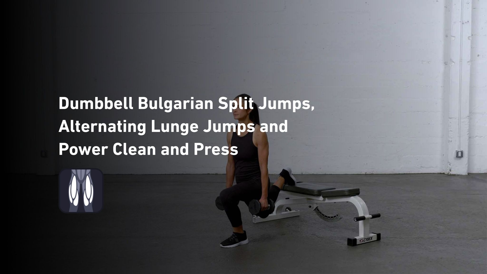

# Chapter 2: Gold Country

*November 26 - December 19, 2025*

---

## The Rhythm Before the Fall

Before the injuries that would sideline me, there was a month of finding my groove. Squash courts and Sierra trails. The body still listening to the brain, feet still quick, lungs still hungry.

---

### Lunch Run
*November 26 | 59m | 8.6 km | Run | HR max: 160*

A midday run through familiar terrain. Nothing epic, just the steady accumulation of miles that builds the base for everything else. Heart rate climbing to 160, legs turning over, the simple math of fitness.

---

### Out to Hite's Cove
*November 28 | 1h 53m | 13 km | Run | HR max: 143*

Run out to a gold mine that was a full town and post office and hotel until the mine went dry. Not much left but a gorgeous river canyon and some iron machinery.

Thanksgiving weekend. While others were recovering from turkey, I was dropping into a canyon that once held dreams of fortune. Hite's Cove - a name that sounds like it should be on an old map, because it is. In the 1860s, John Hite struck gold here and built a town around it. Hotel, post office, store, all the infrastructure of ambition.

Now the river has reclaimed most of it. Moss grows over rocks that might have been foundations. The canyon walls still hold that particular California light - golden even when the gold is gone. I ran down to where the water runs clear over stones, stood where miners once stood, and felt the particular peace of places that have been abandoned to beauty.

---

### Went Back After Running It and Liking It So Much
*November 29 | 4h 52m | 12.3 km | Hike*

And brought Miche :)

Some places demand a return. The canyon was too good to keep to myself. Brought Miche the next day, took our time, nearly five hours to cover what I'd run in two. But hiking pace lets you see things running pace misses - the way light moves through oak canopy, the specific green of moss on north-facing rock, the sound the river makes when you're not breathing too hard to hear it.

---

## The Squash Sessions

Between the trails, the courts. Squash became the metronome of the weeks.

### Afternoon Squash
*December 2 | 1h 6m | Workout | HR max: 157*

An hour of chasing a small rubber ball around a white box. There's something meditative about squash once you're fit enough to stop thinking about breathing. The ball becomes the only thing - where it's going, where it will bounce, where you need to be. The rest of the world waits outside the glass.

### Post Squash Rowing Finisher
*December 2 | 3m | Workout | HR max: 124*

Three minutes on the erg after squash. Not enough to matter, just enough to remember that other movements exist.

### Post Squash Leg Finisher
*December 2 | 31m | Weight Training | 5,220 lb lifted*

Squash destroys the legs in a particular way - all lateral movement, all sudden stops. The weight room afterward is either medicine or masochism, depending on how you look at it. 5,220 pounds lifted, distributed across movements designed to balance out the asymmetries that racquet sports create.

### Afternoon Squash
*December 4 | 1h 7m | Workout | HR max: 165*

Heart rate cresting 165. The kind of session where the rallies get longer and the recovery gets shorter. December squash, when the courts are cold at first and steaming by the end.

### Morning Squash
*December 6 | 1h 22m | Workout | HR max: 165*

Weekend morning session. Nearly ninety minutes on court, effort level high enough that the heart rate maxed the same 165 as the weekday session. Some numbers are ceilings you keep bumping against.

---

## The Quiet Weeks

Then a gap. December 6 to December 19 - thirteen days without a recorded activity. The body was asking for something. Rest, maybe. Or something was brewing that would later manifest as the injuries mentioned in the chapter that comes after this one.

### Afternoon Squash
*December 19 | 1h 16m | Workout | HR max: 158*

Back on court after the gap. Heart rate lower than before - 158 instead of 165. Either detraining or the body protecting itself, sandbagging before whatever was coming.

### Evening Workout
*December 19 | 3m | Workout | HR max: 144*

Three minutes of something. A finisher or a failed start, the data doesn't say. Just a blip of effort on a day that would be the last before things changed.

---

## Looking Back

Reading this chapter now, knowing what comes next, I can see the signs I missed at the time. The thirteen-day gap. The lower heart rate on return. The body was trying to tell me something, and I was too busy chasing squash balls to listen.

But the Hite's Cove runs - those were pure. Finding an abandoned gold town, loving it enough to come back the next day with someone to share it. That's what this is all for, ultimately. Not the fitness, not the numbers, but the moments when a trail drops you into somewhere unexpected and you think: *this is why I do this*.

---

*Chapter 2 Complete*

**Stats Summary:**
- Total activities: 10
- Total distance: ~46 km
- Activity types: Running, Hiking, Squash, Weight Training, Rowing
- Gold mines visited: 1
- Return trips to gold mines: 1
- Days in mysterious gap: 13

---

*Next chapter: Further back in time...*
