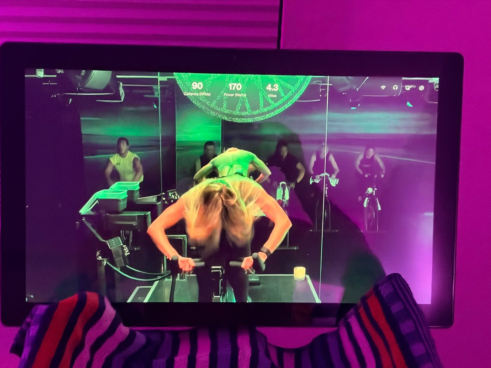
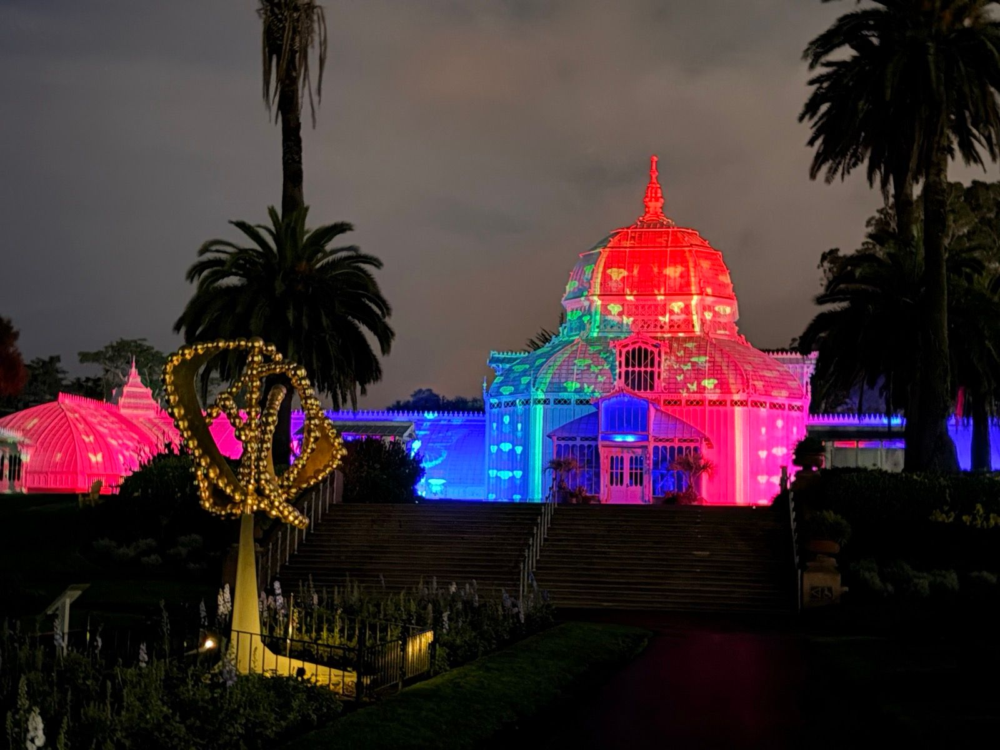
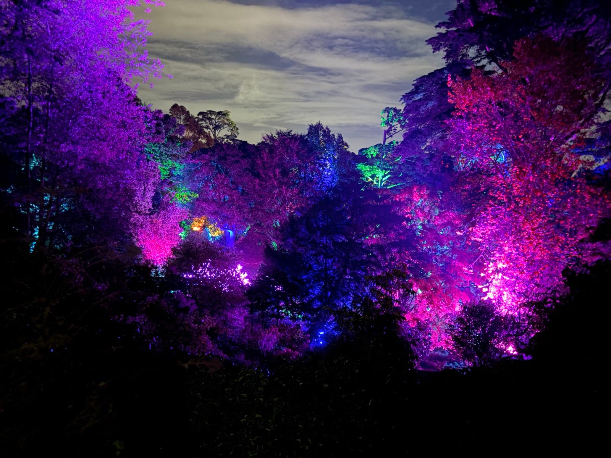
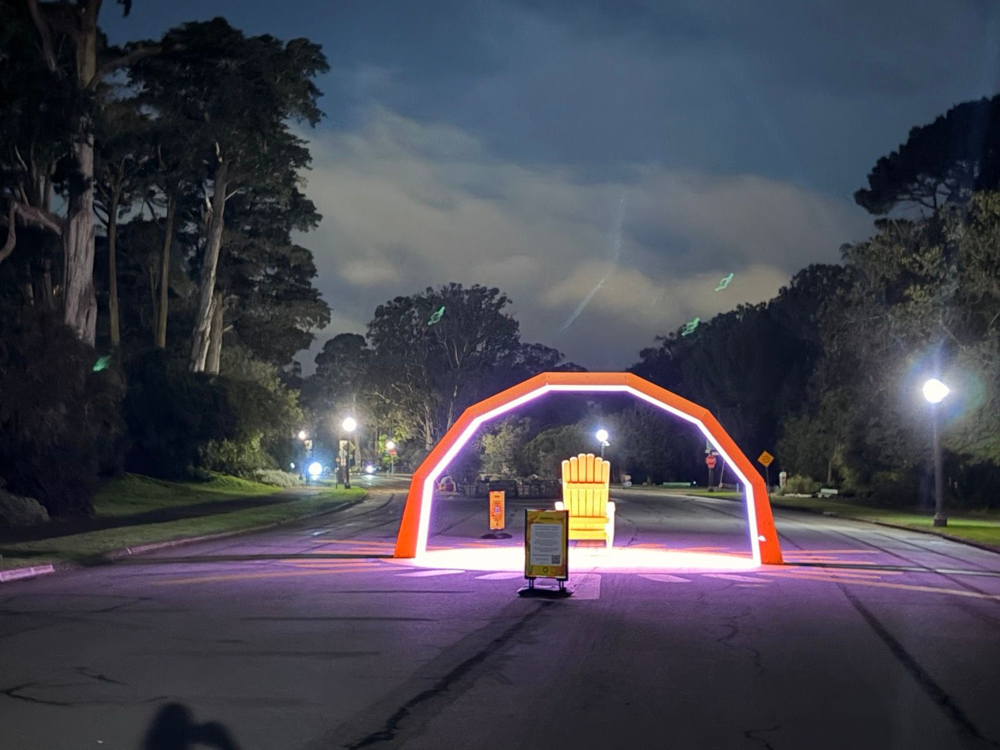
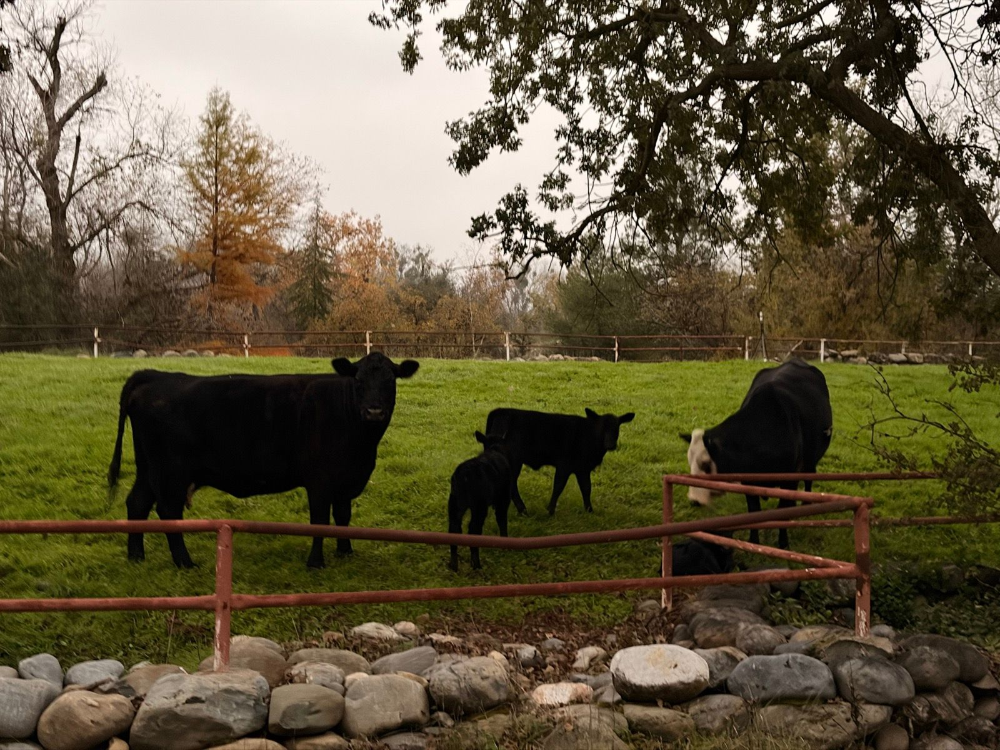

# Chapter 3: Lights in the Dark

*November 4 - November 25, 2025*

---

## The Calf, The Dark, The Grind

November. The clocks had fallen back, and suddenly every evening run was a race against darkness. The calf was still making itself known - that particular tightness that says *go easy or pay later*. Work was brutal. The body was rebuilding. And somewhere in the middle of it all, the city put on a light show.

---

### Dark So Soon -> Quick Indoor HIIT Spin
*November 4 | 32m | Indoor Ride | HR max: 156*

The title says it all. One week into daylight saving time and the evening had already been stolen. The bike trainer became the default - thirty-two minutes of intervals in the garage, heart rate climbing to 156, sweat dripping onto concrete. Not glamorous, but it keeps the engine running when the sun won't cooperate.

---

### Evening Run with Colors
*November 6 | 56m | 7.8 km | Run | HR max: 144*

Rehabbing the calf some more.

The calf had been a problem for weeks now. Every run was a negotiation - how fast can I go before it complains? How far before it tightens? This one stayed easy, heart rate capped at 144, pace relaxed enough to notice the fall colors finally arriving. November in San Francisco - when the few deciduous trees remember they're supposed to change.

---

### Light Cardio After Shots Before Holidays
*November 11 | 36m | 4.8 km | Run | HR max: 137*

Post-vaccine movement. The modern ritual of getting jabbed and then doing something gentle to keep the lymph moving. Five kilometers at a pace that wouldn't stress an immune system already busy learning new tricks.

---

### Evening Yoga
*November 12 | 27m | Yoga | HR max: 95*

Heart rate: 95. The lowest max of the month. Sometimes recovery looks like lying on a mat and breathing deliberately. The calf needed this. The mind needed this. Everything needed this.

---

### Afternoon Squash
*November 13 | 20m | Workout | HR max: 152*

Testing the waters. Twenty minutes on court, heart rate climbing fast to 152. The calf held. Short sessions were the strategy - enough to remember the game, not enough to re-injure.

---

### First Round Robin Post Injury
*November 15 | 1h 45m | Workout | HR max: 164*

Fitness not quite there, though squash is a crucible for that.

The real test. A round robin means multiple matches, no hiding from accumulated fatigue. An hour forty-five on court, heart rate peaking at 164, the kind of effort that reveals exactly where you are. The fitness wasn't there - you can't fake it in squash. The ball doesn't care about your excuses. But showing up was the point. Losing to players I should beat was the tax for time off. The calf survived.

---

### Stumbled Onto a Light Show at the Botanical Gardens
*November 18 | 49m | 7.4 km | Run | HR max: 144*

Nice antidote to the skull-and-gun kind of days I'm having at work.

Work had been brutal. The kind of brutal that makes you use skull-and-gun emoji in your activity descriptions. But running has this way of delivering gifts when you need them most.

I'd set out for a standard Golden Gate Park loop and stumbled into another world. The Conservatory of Flowers was glowing like something from a fever dream - pinks and reds and blues washing over Victorian glass. The trees had been strung with lights, transforming the familiar paths into something alien and beautiful.

Sometimes the city does this. It takes a Tuesday evening when you're ground down by work and burned out on everything and it hands you a light show. You don't deserve it. You didn't earn it. It's just there, free, for anyone who happens to be running through the park at the right moment.

---

### League Squash
*November 21 | 1h 18m | Workout | HR max: 166*

Bit of a warm up, 3 quick games (victory at least), then forgot my watch was still recording.

Back to competition. Three games, all wins. The fitness was returning, slowly. Heart rate topped out at 166 - higher than the round robin, which meant I was pushing harder, trusting the calf more. The watch kept recording after I'd finished, logging whatever I did in the locker room. Data hygiene: still a work in progress.

---

### Alluvial Nooks and Crannies
*November 22 | 44m | 6.2 km | Run | HR max: 142*

The weekend run. Easy pace through terrain carved by water over millennia - those alluvial nooks that make Bay Area trails feel older than they are. Heart rate staying moderate, calf staying quiet, mind staying empty. The best runs are the ones where you forget you're running.

---

### Short One Before Dark
*November 25 | 32m | 5.6 km | Run | HR max: 153*

Racing the sunset again. Five and a half kilometers squeezed into the gap between work ending and darkness falling. Heart rate higher than the weekend - 153 - because there wasn't time to ease into it. These are the runs that maintain sanity when there's no time for anything longer.

---

## The Shape of Recovery

Looking back at this month, the pattern is clear: rebuilding. The calf set the terms, and I negotiated within them. Short squash sessions, easy runs, indoor bikes when the dark came too early. The light show at the botanical gardens stands out - that unexpected gift in the middle of a grinding month.

Work was bad. The body was compromised. But I kept moving, kept showing up, kept finding reasons to lace up shoes even when the reasons were thin. That's what November was: maintenance mode. Keeping the pilot light burning until conditions improved.

---

*Chapter 3 Complete*

**Stats Summary:**
- Total activities: 10
- Total distance: ~44 km
- Activity types: Running, Indoor Cycling, Squash, Yoga
- Calf complaints: Ongoing but manageable
- Light shows stumbled upon: 1
- League matches won: 3
- Work stress level: Skull-and-gun emoji

---

*Next chapter: Further back in time...*
