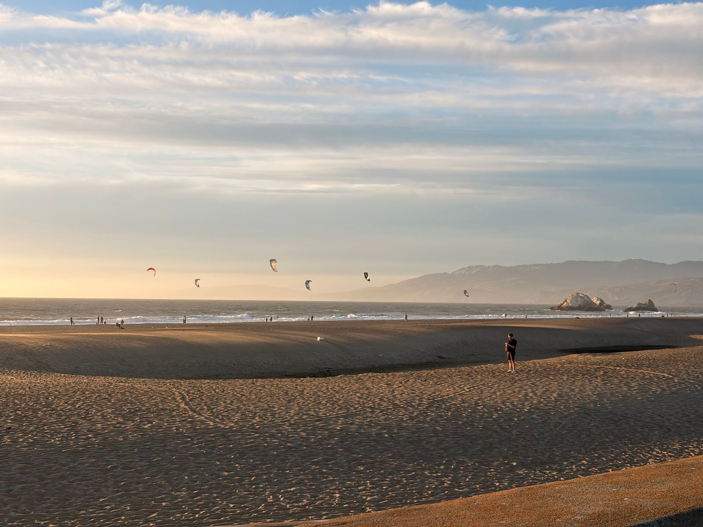
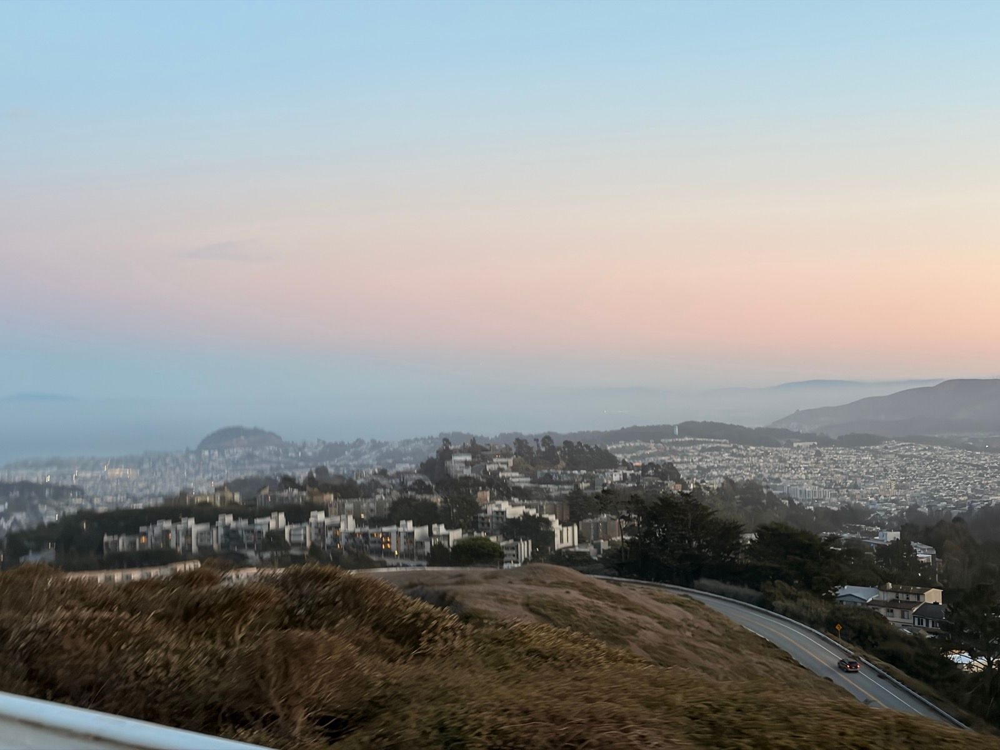
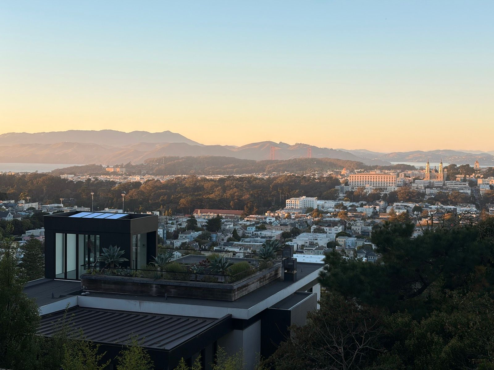
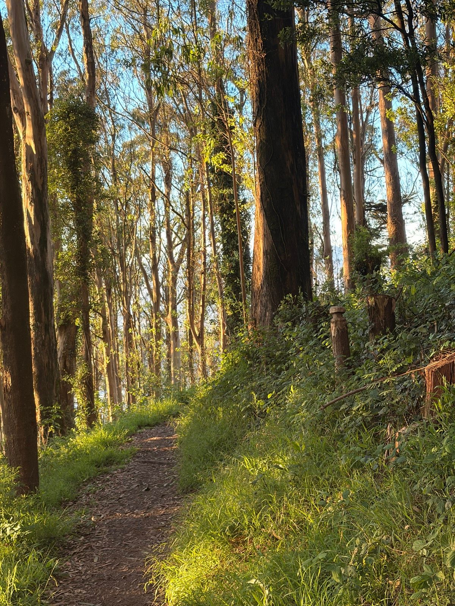

# Chapter 4: The Pop

*October 13 - October 31, 2025*

---

## Before the Fall

Every injury has a moment. A pop, a twinge, a sudden wrongness where rightness used to be. This chapter contains that moment. But first, the days before - when the body still worked and the only scaries were on Sundays.

---

### Silencing Sunday Scaries
*October 13 | 1h 11m | 24.8 km | Ride | HR max: 150*

For an hour at least.

Sunday evening. That particular dread that starts building after lunch and peaks around dinner - the knowledge that Monday is coming and there's nothing to be done about it. The antidote: pedaling toward the ocean until the only thing in your head is the gradient and the wind.

Twenty-five kilometers through the city as the sun dropped. Ocean Beach was alive with kitesurfers catching the last light, their sails bright against the darkening water. For an hour, the week ahead didn't exist. That's all you can ask of a Sunday ride.

---

### Was Playing Quite Well Until My Calf Popped
*October 15 | 27m | Workout | HR max: 157*

I would not recommend aging.

There it is. The moment. Twenty-seven minutes into a squash session, playing well, moving well, and then - *pop*. That unmistakable sensation of something letting go that shouldn't have. The calf muscle announcing it had reached its limit.

The description says it all: "I would not recommend aging." This is the entry point for everything that follows - the recovery runs in Chapter 3, the careful rebuilding in November, the tentative return to the court. All of it traces back to this single moment on October 15th when the body reminded me that it has its own schedule.

---

## The Aftermath

### Afternoon Ride
*October 20 | 10m | Ride | HR max: 97*

Five days later. Ten minutes on the bike, heart rate barely cracking 100. Testing. Can I pedal? Can I put any load through the leg? The calf said: *maybe*.

### Afternoon Elliptical
*October 20 | 8m | Elliptical | HR max: 121*

Eight more minutes on the elliptical. Low impact, controlled movement. Heart rate climbing a bit higher - 121 - but nothing explosive, nothing sudden. The careful calculus of injury: what can I do that won't make it worse?

---

### Recovery/Sanity Ride
*October 22 | 54m | 18.7 km | Ride | HR max: 118*

A week after the pop. Eighteen kilometers at a pace that would embarrass a casual cyclist, heart rate maxing at 118. But this wasn't about performance - it was about sanity. The mind needs movement even when the body can't provide much. This ride was therapy, not training.

---

### Afternoon Workout
*October 23 | 20m | Workout | HR max: 110*

Twenty minutes of something. Upper body, probably. The parts that still worked, while the calf sat sulking in its compression sleeve.

---

### Twin Climbs of Twin Peaks
*October 25 | 34m | 10.5 km | Ride | HR max: 150*

Sneaking in a couple hard and short climbs before dinner.

Ten days post-injury, and the itch was becoming unbearable. Twin Peaks - those twin climbs that reward suffering with views. Heart rate hit 150, which meant I was actually trying. The calf complained but held. Sometimes you need to test the limits to know where they are.

---

### Light Run to Test the Recovering Calf
*October 28 | 26m | 3.4 km | Run | HR max: 128*

Felt a bit of soreness, will see how it feels tomorrow.

The first run since the pop. Three and a half kilometers of careful footstrikes and constant monitoring. Every step a question: *are you okay? are you okay? are you okay?* The calf answered with soreness but not pain. A distinction that matters.

The city was doing its golden hour thing - that light that makes San Francisco look like it belongs in a different era. I ran slowly enough to notice it, which was either patience or necessity. Probably both.

---

### Rowing Machine
*October 31 | 10m | 2.3 km | Rowing*

Halloween. While others were out in costumes, I was on a rowing machine - the ultimate non-impact exercise. 2.3 kilometers of pulling, the calf completely disengaged. This is what injury recovery looks like: finding the movements that don't hurt and doing them until the ones that do hurt become possible again.

### Afternoon Workout
*October 31 | 20m | Workout | HR max: 129*

More upper body, probably. More maintaining what could be maintained while waiting for the calf to decide it was ready.

---

## What Injuries Teach

Looking back, the calf injury was a pivot point. Everything before it was building fitness, accumulating miles, pushing limits. Everything after was negotiation - with the body, with expectations, with the gap between what I wanted to do and what I could do.

The pop itself lasted a fraction of a second. The recovery lasted months. That's the math of injury, and there's no way around it.

But there's a gift hidden in these forced slowdowns. You learn what you actually need versus what you think you need. You discover that sanity rides matter. You find out that the city is beautiful at slow-run pace. You remember that the body heals if you let it.

October ended with me on a rowing machine on Halloween, pulling steadily toward recovery. Not glamorous. Not fast. But forward.

---

*Chapter 4 Complete*

**Stats Summary:**
- Total activities: 10
- Total distance: ~70 km
- Activity types: Cycling, Squash, Elliptical, Running, Rowing, Workouts
- Calf injuries: 1 (significant)
- Days from injury to first run: 13
- Sunday scaries silenced: 1
- Bodies that betrayed expectations: 1

---

*Next chapter: The days before everything changed...*
