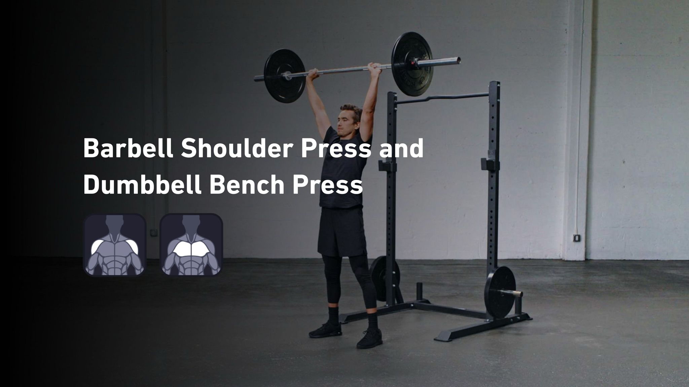
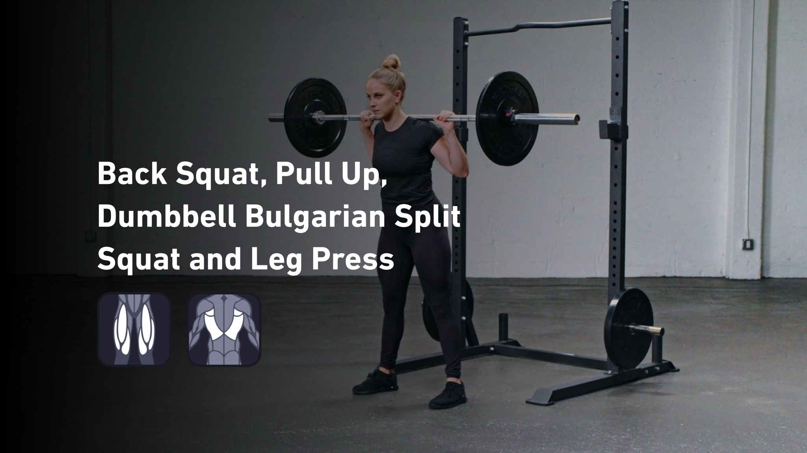
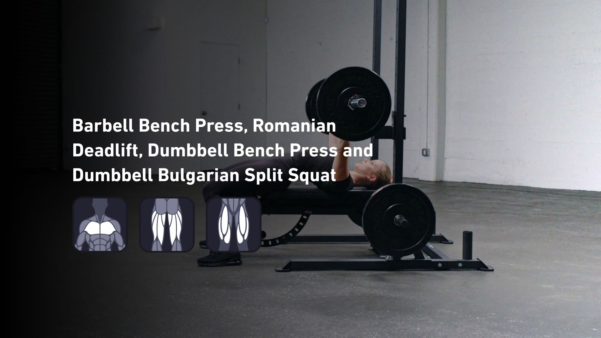
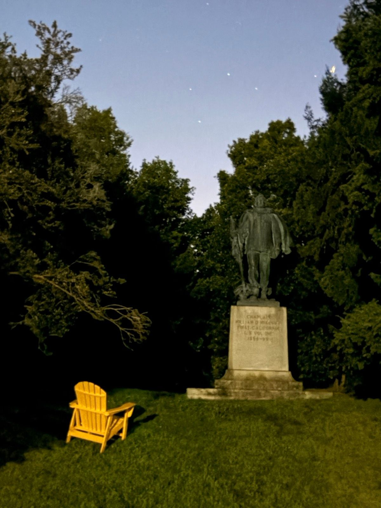

# Chapter 5: Before the Pop

*September 27 - October 11, 2025*

---

## Peak Season

The two weeks before the calf gave out. Reading this now feels like watching someone walk toward a cliff edge, knowing they can't see it coming. But that's hindsight. In the moment, this was just October - squash season, lifting season, the body doing what it was asked.

---

### Afternoon Squash
*September 27 | 1h 29m | Workout | HR max: 162*

An hour and a half on court. Heart rate maxing at 162. The calf that would betray me in eighteen days was working perfectly, pushing off, pivoting, doing all the things calves do when they're healthy. I didn't appreciate it at the time. You never do.

### Monthly Vanity Muscle Maintenance - Shoulders, Chest
*September 27 | 22m | Workout | 5,750 lb lifted*

The honest title for what most gym bros won't admit: sometimes you lift just because you want to look a certain way. Shoulders and chest - the muscles that show in t-shirts. 5,750 pounds moved in twenty-two minutes. Vanity, served.

---

### Fitbod - Quadriceps, Back
*September 30 | 34m | Weight Training | 18,300 lb lifted*

A more serious session. Eighteen thousand pounds of leg and back work. The quads and back that would need to compensate when the calf went down were being built right here, unknowingly preparing for injury duty.

---

### Evening Yoga
*October 3 | 32m | Yoga | HR max: 94*

Thirty-two minutes of stretching and breathing. Heart rate barely above resting. The kind of session that feels optional until you skip it for a few weeks and everything starts tightening up. The calf was being stretched here too, being given every chance.

---

### Afternoon Squash
*October 4 | 45m | Workout | HR max: 162*

Back on court. Forty-five minutes, heart rate again hitting 162. The squash rhythm was good - court time accumulating, movement patterns sharpening. Eleven days before the pop.

---

### Afternoon Squash
*October 5 | 1h 8m | Workout | HR max: 161*

Another session. Over an hour this time. The body was getting what it asked for - consistent court time, regular stress, the kind of training that builds capacity. Or overreaches. The line between them is invisible until you cross it.

### Fitbod - Chest, Hamstrings, Quadriceps
*October 5 | 33m | Weight Training | 8,980 lb lifted*

Doubling up - squash and lifting in the same day. Nine thousand pounds of iron after an hour of court sprints. Was this the day that planted the seed of injury? Or just another brick in the foundation? The data doesn't say.

---

### Lunging w Luke While He's Local for Luke's Local
*October 7 | 1h 2m | Workout | HR max: 158*

A friend in town. An hour of squash with someone whose name apparently inspired the activity title. Luke's local, whatever that means. The social side of the sport - the reason it's not just exercise but something you actually look forward to.

---

### Running to Feel Something
*October 10 | 47m | 6.5 km | Run | HR max: 132*

Mostly my sore hamstrings.

The title cuts deep. "Running to feel something." There are days when the mind is numb and the only way to reboot is physical effort. This was one of those. The hamstrings were sore from all the squash and lifting, but the run wasn't really about the hamstrings. It was about proving you're still alive when everything feels gray.

Six and a half kilometers of moving through space, heart rate staying moderate, the mind slowly unsticking from whatever had glued it down.

---

### Afternoon Squash
*October 11 | 1h 47m | Workout | HR max: 166*

The last big squash session before the injury. Nearly two hours on court, heart rate peaking at 166 - the highest of this stretch. The calf was working hard, maybe too hard. Four days later, it would give up.

But on this day, it held. The body performed. The game was good. And I walked off the court having no idea what was coming.

---

## The Unknowing

That's what strikes me most about this chapter - the complete absence of foreshadowing. There's no "felt a twinge" or "something didn't feel right." The calf just worked until it didn't. The injury appeared out of what seemed like health.

Maybe that's always how it happens. You train consistently, you feel strong, and then one day the tissue that's been accumulating micro-damage finally says *enough*. The warning signs were probably there - in the soreness, in the volume, in the back-to-back sessions without adequate recovery. But I wasn't looking for them.

October 11th: nearly two hours of squash, feeling fine.
October 15th: pop.

Four days. That's all that separated peak performance from injury. The body is like that - it lies about its condition right up until it tells the truth.

---

*Chapter 5 Complete*

**Stats Summary:**
- Total activities: 10
- Activity types: Squash, Weight Training, Yoga, Running
- Total weight lifted: ~33,000 lb
- Hours of squash: ~6
- Days until calf injury: 4 (at end of chapter)
- Warning signs noticed: 0

---

*Next chapter: Further back, deeper into fall...*
