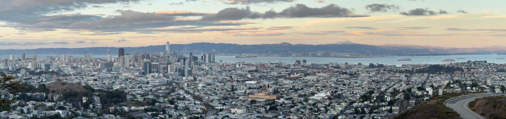
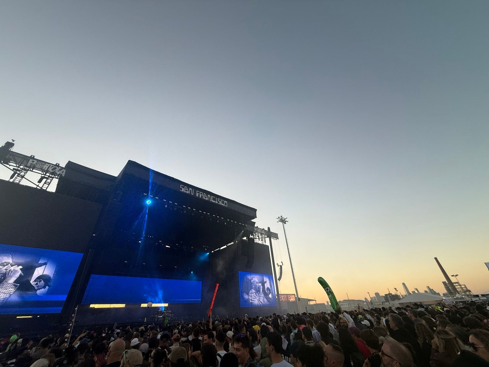
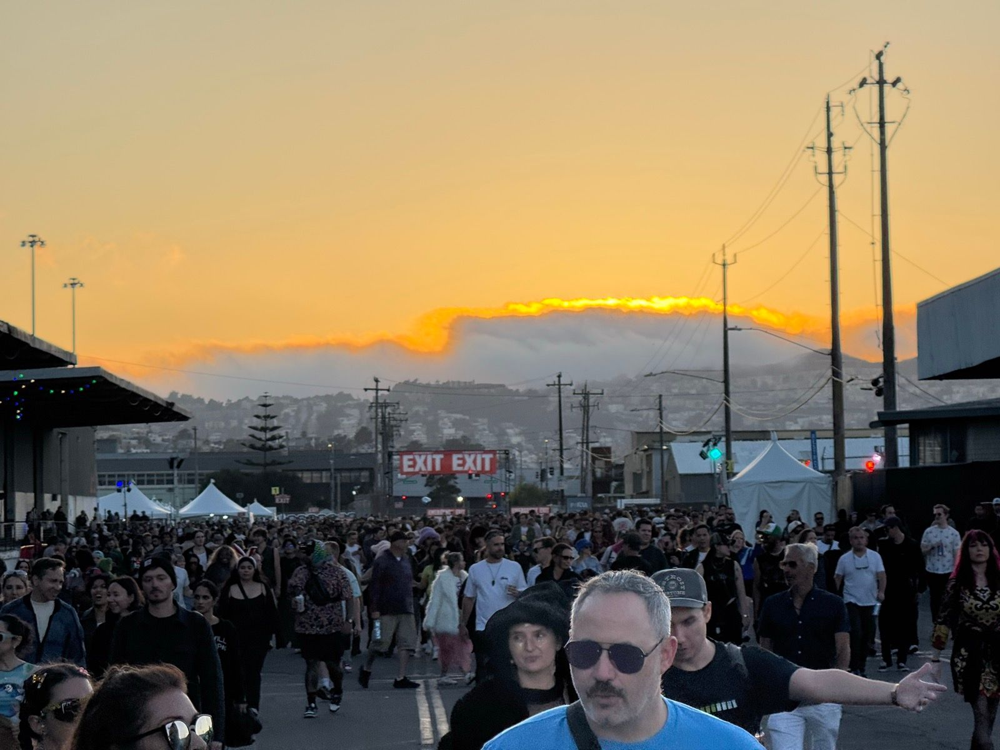
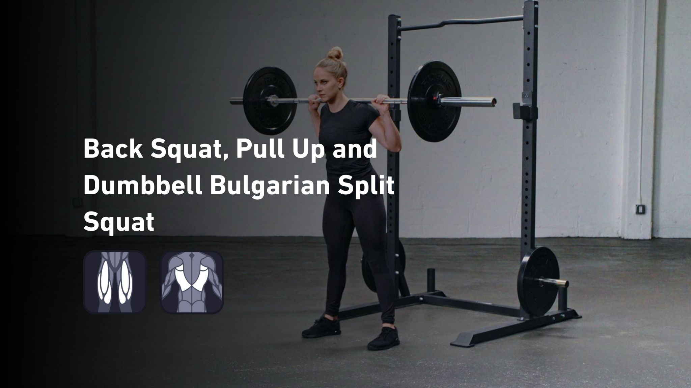
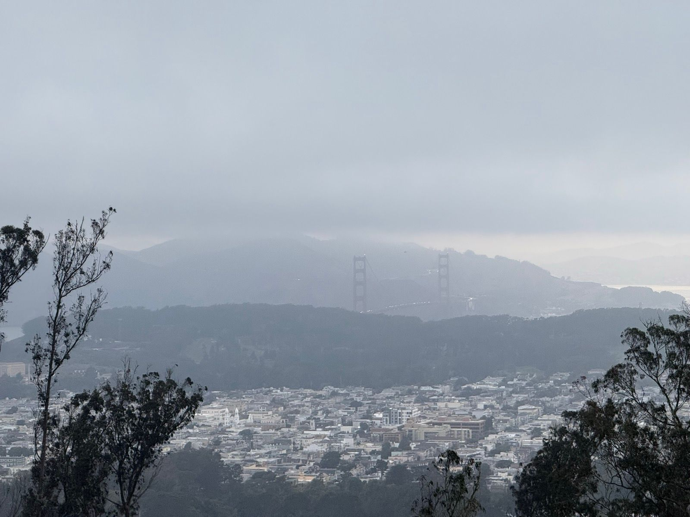

# Chapter 6: Dancing Through September

*September 8 - September 26, 2025*

---

## The Steady State

September. The month before the body started sending warnings. Squash was clicking, the evening rides were golden, and one weekend the running watch captured something it wasn't designed for: dancing.

---

### Running Slow Through the Sunrise
*September 8 | 48m | 5.6 km | Run | HR max: 146*

Felt extremely slow, though, which the pace confirmed.

Some runs just feel like trudging through mud. This was one of those - the kind where your legs feel disconnected from your intentions and the watch confirms what you already knew: you're going nowhere fast. But slow runs count too. Maybe they count more, when you show up anyway.

---

### Morning Squash
*September 10 | 48m | Workout | HR max: 163*

A morning session - the kind where you're warmed up before work has a chance to stress you out. Heart rate climbing to 163, the body doing what it's trained to do. Squash as morning meditation.

---

### Evening Ride
*September 12 | 1h | 23.7 km | Ride | HR max: 143*

Twenty-three kilometers through the city as the sun dropped. September evenings in San Francisco are stolen time - the fog holds off, the light goes golden, and the hills feel worth the effort. This was one of those rides where you don't want to stop because stopping means the day is over.

---

### Morning Squash
*September 15 | 49m | Workout | HR max: 156*

Another morning session. The pattern was set: squash before work, the day starting with effort instead of email.

---

### Evening Yoga
*September 18 | 9m | Yoga | HR max: 93*

Nine minutes. Barely enough to stretch anything. But sometimes that's what fits between everything else - a token gesture toward flexibility, a brief pause in the relentless forward motion.

---

### Evening Squash
*September 19 | 1h 29m | Workout | HR max: 164*

An hour and a half after work. Heart rate pushing 164. The squash was getting serious - longer sessions, higher intensity. The calf that would give out in three weeks was working hard.

---

### Worst Splits Ever
*September 22 | 4h 23m | 13.2 km | Run | HR max: 131*

Great dancing though.

The Strava doesn't lie, even when you're not really running. Four hours and twenty-three minutes. Thirteen kilometers. Pace: absolutely terrible. Because this wasn't a run - it was Portola Festival, the watch still recording while the body did something far more important than cardio.

The San Francisco waterfront transformed into a sea of bass and beats. The "run" was actually wandering between stages, dancing until the legs gave out for good reasons instead of bad ones, moving thirteen kilometers over four hours because that's what happens when you're chasing sound instead of pace.

Worst splits ever. Best dancing though. Some activities don't fit neatly into training categories.

---

### Afternoon Squash
*September 23 | 1h 30m | Workout | HR max: 165*

The day after the festival. Body tired in that specific way that dancing creates - not quite exercise fatigue, more like joy hangover. Still showed up to squash though. Heart rate still hit 165. The fitness was there even when the motivation came from momentum.

### Legs and Back Finisher Post Squash
*September 24 | 19m | Weight Training | 7,575 lb lifted*

After an hour and a half of squash, straight to the weight room. Seven thousand pounds of additional work. September me was not messing around. This was the peak, though I didn't know it yet.

---

### Evening Weighted Hike
*September 26 | 1h 2m | 5.7 km | Hike | HR max: 122*

A weighted pack on the back, hills under the feet. Six kilometers with extra resistance - training for something, or just enjoying the suffering. Heart rate staying controlled at 122 despite the load. This is what base fitness feels like: being able to add weight and still feel comfortable.

---

## The Shape of Fitness

Looking at September now, from the other side of injury, it looks like a peak. Squash multiple times per week. Evening rides. A festival that became a 13k dance party. The body was responding to everything asked of it.

That's the thing about peaks - you can't see them from the top. You just think it's normal. Of course you can play ninety minutes of squash and lift afterward. Of course you can dance for four hours and play squash the next day. The body does what it's always done.

Until it doesn't.

But this chapter was before all that. This was September, when everything worked, and the only thing on my mind was the music.

---

*Chapter 6 Complete*

**Stats Summary:**
- Total activities: 10
- Total distance: ~48 km (plus 13km of dancing)
- Activity types: Running, Squash, Cycling, Yoga, Weight Training, Hiking
- Festivals attended: 1 (Portola)
- Hours of dancing logged as "running": 4.4
- Split times: Worst ever (no regrets)

---

*Next chapter: Deep into summer...*
